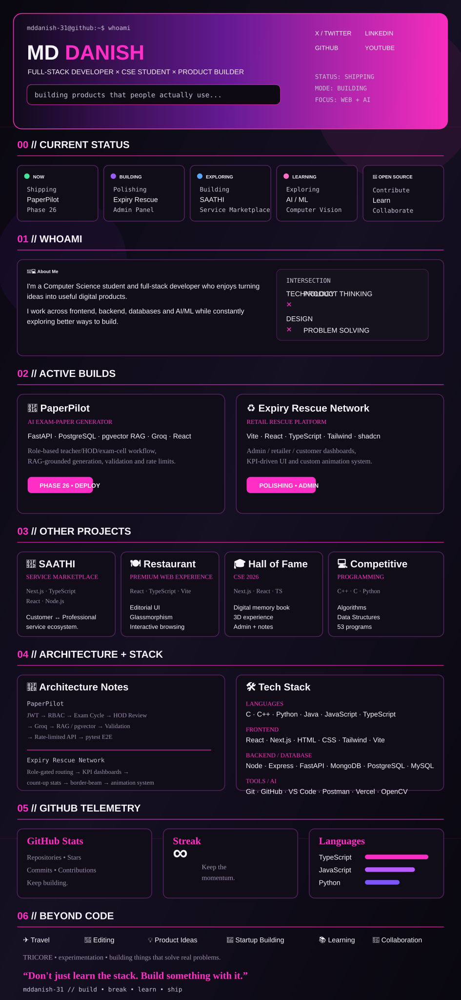

  

  

 

<code>📍 India</code> &nbsp;•&nbsp; <code>🕒 IST</code> &nbsp;•&nbsp; <code>⚡ Always Building</code> &nbsp;•&nbsp; <code>🧠 Always Learning</code>

---

## DANISH // BUILD SYSTEM

### IDEA → DESIGN → ENGINEERING → PRODUCT → SHIP

> I don’t just want to learn technologies. I want to use them to build things that actually work.

---

## 🔭 Right Now

- **PaperPilot** → Phase 26 / deployment — FastAPI + PostgreSQL + pgvector RAG + Groq + React
- **Expiry Rescue Network** → polishing the admin panel — Vite + React + TypeScript + Tailwind + shadcn
- **SAATHI** → building a service marketplace — Next.js + React + TypeScript + Node.js
- **AI / ML** → exploring Python, OpenCV, MediaPipe and computer-vision applications
- **TRICORE** → exploring product, startup and business ideas

---

## 📄 PaperPilot

**AI exam-paper generator**

FastAPI · Postgres · pgvector RAG · Groq · React — role-based for teacher/HOD/exam-cell workflows.

**Architecture:** JWT auth + RBAC → exam-cycle workflow → HOD review → Groq generation grounded through RAG → validation → rate-limited API → pytest end-to-end testing.

---

## 🛒 Expiry Rescue Network

**Retail rescue platform**

Vite · React · TypeScript · Tailwind · shadcn — admin/retailer/customer dashboards, KPI-driven UI, count-up statistics, border-beam interactions and a consistent animation system.

---

## 🤝 Other Builds

| Project | What it is | Stack |
|---|---|---|
| **SAATHI** | Service marketplace connecting customers with professionals | Next.js · React · TypeScript · Node.js |
| **Restaurant Atelier** | Premium restaurant experience with editorial UI | React · TypeScript · Vite |
| **Hall of Fame — CSE 2026** | Interactive digital memory-book experience | Next.js · React · TypeScript · Node.js |
| **Competitive Programming** | Programming, algorithms and problem-solving collection | C++ · C · Python |

- [SAATHI](https://github.com/mddanish-31/Saathi)
- [Restaurant Atelier](https://github.com/mddanish-31/Restaurant-Atelier)
- [Hall of Fame — CSE 2026](https://github.com/mddanish-31/Hall-of-Fame-Sec-D-CSE-2026)
- [Competitive Programming](https://github.com/mddanish-31/Competitive_Programming)

---

## ⚙️ Stack

**Languages:** C · C++ · Python · Java · JavaScript · TypeScript

**Frontend:** React · Next.js · HTML · CSS · Tailwind · Vite

**Backend:** Node.js · Express · FastAPI

**Databases:** MongoDB · PostgreSQL · MySQL

**Tools:** Git · GitHub · VS Code · Postman · Vercel · Docker

**AI / Computer Vision:** Python · OpenCV · MediaPipe

---

## 🧠 Behind the Projects

<b>PaperPilot — architecture notes</b>

JWT auth → RBAC → teacher/HOD/exam-cell → exam cycle → HOD review → Groq → RAG / pgvector → validation → rate limiting → pytest E2E

 

<b>Expiry Rescue Network — architecture notes</b>

Role-gated routing across admin/staff/customer, KPI-driven dashboards, count-up stats, border-beam hover effects and a locked animation system for consistent visual output.

---

## 📊 GitHub

  

  

  

  

  

---

## 🌱 Beyond Code

<code>✈️ Travel</code> · <code>🎨 Editing & Design</code> · <code>💡 Product Ideas</code> · <code>🚀 Startup Building</code> · <code>📚 Learning</code> · <code>🤝 Collaboration</code> · <code>🧪 Experimenting</code>

I’m also building around **TRICORE**, exploring how technology, product development and business ideas can come together.

---

## 📈 Ship Log

LEARN → BUILD → BREAK → UNDERSTAND → IMPROVE → POLISH → SHIP → REPEAT

> **Don’t just learn the stack. Build something with it.**

---

### Let’s build something.

  

